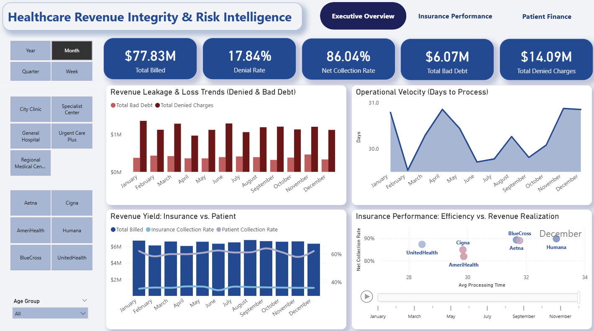
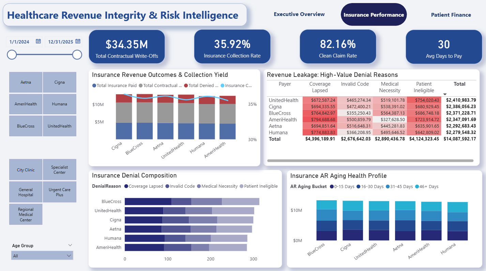
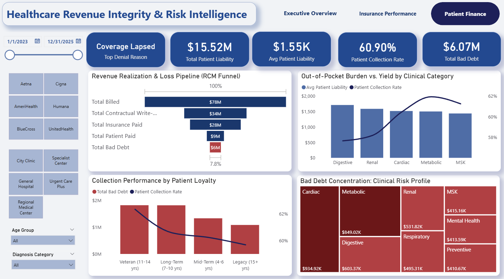

# healthcare-revenue-integrity-dashboard
Power BI dashboard analyzing healthcare revenue cycle risk, denials, collections, and patient financial responsibility.

# Healthcare Revenue Integrity & Risk Intelligence Dashboard

### Data Disclaimer
**IMPORTANT:** All data utilized in this project is **synthetic/dummy data**. It has been programmatically generated for demonstration purposes and does not represent real patient records, actual healthcare facilities, or proprietary insurance contract details. This project demonstrates RCM analytical capabilities while maintaining strict HIPAA-compliance standards.

---

## 1. Project Overview
**What problem are we solving?**
Healthcare organizations lose millions annually to "Revenue Leakage"—money earned clinically but never collected due to administrative denials, poor payer realization, or patient bad debt.

This project analyzes a **$77.8M billing portfolio** to simulate a full Revenue Cycle Management (RCM) funnel. It moves beyond simple reporting to provide **Revenue Integrity Intelligence**, pinpointing exactly where friction occurs between the service date and the bank deposit.

## 2. Business Questions Answered
* **Leakage Detection:** Where is the revenue eroding—contractual write-offs, payer denials, or patient non-payment?
* **Clinical Risk:** Which diagnosis categories (e.g., Cardiac vs. MSK) generate the highest concentration of bad debt?
* **Insurance Scorecard:** Which insurance payers have strong operational efficiency but weak financial realization?
* **Patient Behavior:** How does patient tenure (<3 years vs. 10+ years) correlate with collection reliability?

## 3. KPI Summary (Snapshot)
| Metric | Value | Context |
| :--- | :--- | :--- |
| **Total Billed Volume** | **$77.83M** | Gross charges generated |
| **Net Collection Rate** | **86.04%** | Cash collected vs. Allowed Amount (True Yield) |
| **Clean Claim Rate** | **82.16%** | Claims paid on first pass (Efficiency) |
| **Denial Rate** | **17.84%** | Claims requiring rework/appeal |
| **Total Bad Debt** | **$6.07M** | Uncollectible patient liability |

## 4. Dashboard Structure

### Executive Overview (Strategic)
Designed for the CFO/VP of Revenue Cycle.
* **Features:** Frequency Toggles (Year/Month/Week), Operational Velocity tracking.
* **Goal:** Monitor the high-level pulse of the revenue cycle and identify macro-trends in processing time vs. collection yield.

### Insurance Performance (Tactical)
Designed for Payer Relations & Billing Managers.
* **Features:** Denial composition analysis, heat-mapped Payer Realization Matrix.
* **Goal:** Identify low-performing contracts and high-friction denial reasons (e.g., "Authorization Missing") to guide front-end process improvements.

### Patient Finance (Operational)
Designed for Collections & Financial Counselors.
* **Features:** Revenue Realization Funnel, Clinical Category Risk Profiling.
* **Goal:** Drill through from high-risk clinical categories (e.g., Cardiac) to specific patient account lists for targeted intervention.

## Key Insights & Findings
* **The "UnitedHealth" Outlier:** Analysis identifies UnitedHealth as a primary driver of operational friction, showing significantly higher processing times compared to other payers, impacting cash liquidity.
* **Clinical Bad Debt Drivers:** **Cardiac** and **Metabolic** diagnosis categories account for the highest concentration of bad debt, driven by high deductible plans and "sticker shock."
* **Denial Root Causes:** "Coverage Lapsed" and "Patient Ineligible" are the dominant denial reasons, indicating a breakdown in front-office eligibility verification rather than clinical coding errors.
* **Operational Efficiency:** The analysis establishes **Clean Claim Rate** as a critical *leading indicator*, where higher first-pass acceptance reduces the administrative burden of appeals and accelerates cash velocity.

## 6. Data Model & Technical Stack
* **Architecture:** Star Schema (Fact_Claims linked to Dim_Patient and Dim_Diagnosis).
* **Tools:** Power BI, DAX, Python (Data Generation), GitHub.
* **Advanced Logic:** Uses a "Waterfall" calculation methodology to track Billed $\to$ Allowed $\to$ Paid $\to$ Balance.

## 7. Intelligence Layers

### 1. Executive Overview (Strategic)
* **Frequency Toggle:** Dynamically shifts trends between Year, Quarter, Month, and Week views.
* **Operational Velocity:** Visualizes "Days to Process" to identify bottlenecks.


*(Click image to view full resolution)*

### 2. Insurance Performance (Tactical)
* **Payer Realization Matrix:** Heat-mapped matrix identifying specific payers with high leakage.
* **Denial Composition:** Stacked analysis of denial counts by reason.



### 3. Patient Finance (Operational)
* **Revenue Realization Funnel:** Visualizes erosion from $78M Billed to $6M Bad Debt.
* **Clinical Risk Profile:** Maps ICD-10 codes to identify high-risk cohorts (Cardiac, Digestive).



*(For full technical details, measures, and logic, see the `/docs` folder).*

---

## 📂 Folder Structure
```text
healthcare-revenue-integrity-dashboard/
│
├── data/              # Raw synthetic datasets
├── dashboards/        # Power BI (.pbix) files
├── docs/              # Technical documentation (DAX, Dictionary, Logic)
├── screenshots/       # Dashboard images for review
└── README.md          # Project overview
