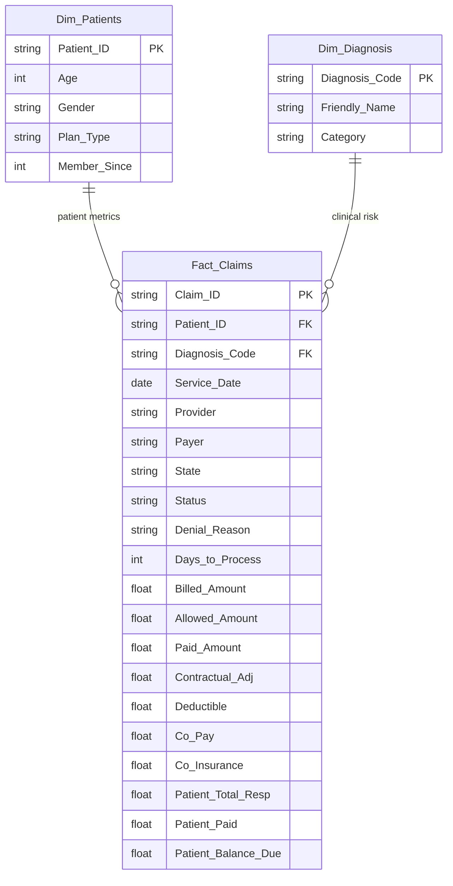

# Data Dictionary & Schema

## Overview
The data model is a **Star Schema** centered around a single fact table (`Fact_Claims`) joined to two dimension tables (`Dim_Patients` and `Dim_Diagnosis`).

* **Source Files:** 3 CSVs
* **Schema Type:** Star Schema
* **Date Logic:** Direct Date Dimension (derived from `Service_Date`)+

---

## Table Relationships

- Fact_Claims.Patient_ID → Dim_Patients.Patient_ID (Many-to-One)
- Fact_Claims.Diagnosis_Code → Dim_Diagnosis.Diagnosis_Code (Many-to-One)

---

## Fact Table: `Fact_Claims`
The transactional heart of the model. Each row represents a single claim/service line.
* **Source:** `Fact_Claims.csv`

| Column | Data Type | Description |
| :--- | :--- | :--- |
| **Claim_ID** | String | Unique identifier for the specific claim. |
| **Patient_ID** | String | Foreign key linking to `Dim_Patients`. |
| **Service_Date** | Date | The primary date field used for all time-series analysis. |
| **Provider** | String | The facility or clinic where service was performed. |
| **Payer** | String | The insurance company billed (e.g., Aetna, UnitedHealth). |
| **State** | String | Location of the service provider. |
| **Diagnosis_Code** | String | Foreign key linking to `Dim_Diagnosis` (ICD-10). |
| **Billed_Amount** | Currency | The gross "sticker price" charged for the service. |
| **Allowed_Amount** | Currency | The maximum negotiated amount the provider can collect. |
| **Contractual_Adj** | Currency | The write-off amount (`Billed_Amount` - `Allowed_Amount`). |
| **Status** | String | Current claim status (Paid, Denied). |
| **Paid_Amount** | Currency | Amount paid by the insurance payer. |
| **Denial_Reason** | String | Reason code if the claim was denied (NULL if Paid). |
| **Days_to_Process** | Integer | Days taken to adjudicate the claim. |
| **Deductible** | Currency | Patient's portion before insurance kicks in. |
| **Co_Pay** | Currency | Fixed patient fee per visit. |
| **Co_Insurance** | Currency | Percentage of the bill the patient is responsible for. |
| **Patient_Total_Resp** | Currency | Total patient liability (`Deductible` + `Co_Pay` + `Co_Ins`). |
| **Patient_Paid** | Currency | Amount actually collected from the patient. |
| **Patient_Balance_Due** | Currency | Remaining uncollected patient liability (Bad Debt Risk). |

### Calculated Columns (DAX)
These fields were engineered within the Fact Table to support the custom "Frequency Toggle."

| Column | Formula | Purpose |
| :--- | :--- | :--- |
| **Week** | `"Week " & WEEKNUM([Service_Date]) & " (" & FORMAT([Service_Date], "MMM") & ")"` | Creates a user-friendly label like "Week 12 (Mar)". |
| **Week_Sort** | `WEEKNUM([Service_Date])` | Numeric helper column to ensure Weeks sort 1-52 correctly. |

---

## Dimension Tables

### `Dim_Patients`
Contains demographic and insurance plan details.
* **Source:** `Dim_Patients.csv`

| Column | Data Type | Description |
| :--- | :--- | :--- |
| **Patient_ID** | String | Primary Key. |
| **Age** | Integer | Patient age at time of service. |
| **Gender** | String | Patient gender (M, F, Other). |
| **Plan_Type** | String | Insurance plan model (HMO, PPO, EPO, POS). |
| **Member_Since** | Integer | Year the patient joined the health system. |

### `Dim_Diagnosis`
A clinical control table mapping raw ICD-10 codes to analytical categories.
* **Source:** `Dim_Diagnosis.csv`

| Column | Data Type | Description |
| :--- | :--- | :--- |
| **Diagnosis_Code** | String | Primary Key (ICD-10 Format). |
| **Friendly_Name** | String | Readable disease name (e.g., "Hypertension"). |
| **Category** | String | Risk grouping (e.g., Cardiac, Metabolic, MSK). |

---

## Interactive Parameters

### Frequency Toggle (Field Parameter)
A dynamic slicer allowing users to switch the X-Axis on charts between different time granularities.
* **Selection Options:** `Year`, `Quarter`, `Month`, `Week`
* **Mechanism:** Switches the axis binding to the respective calculated date columns in `Fact_Claims`.

---

## Author

Kristine Soliman  
Data & Operations Analyst | Chandler, AZ
